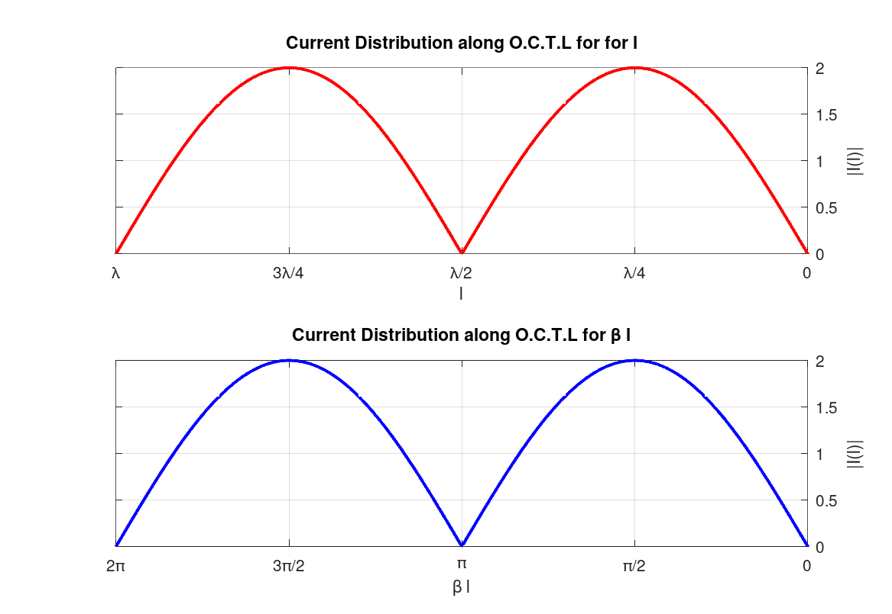
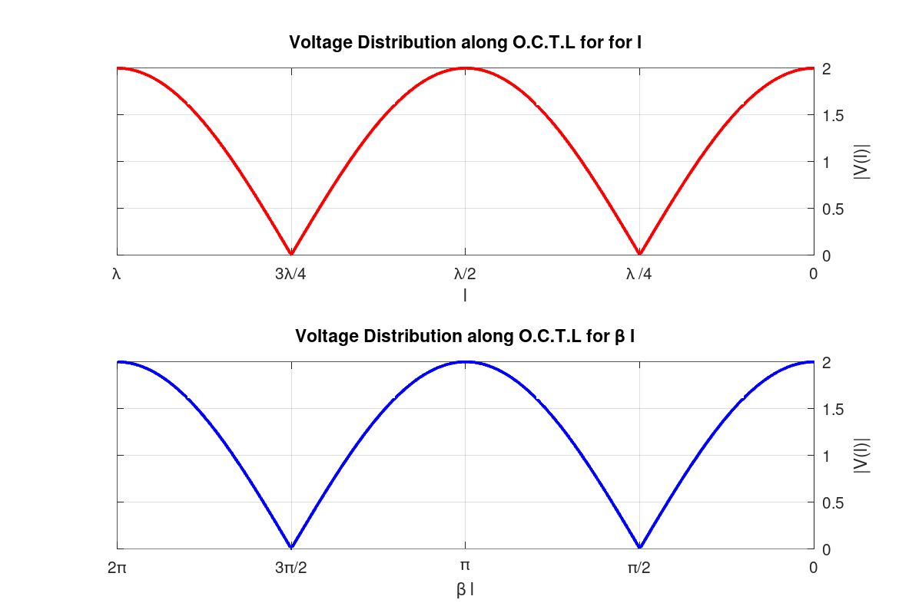
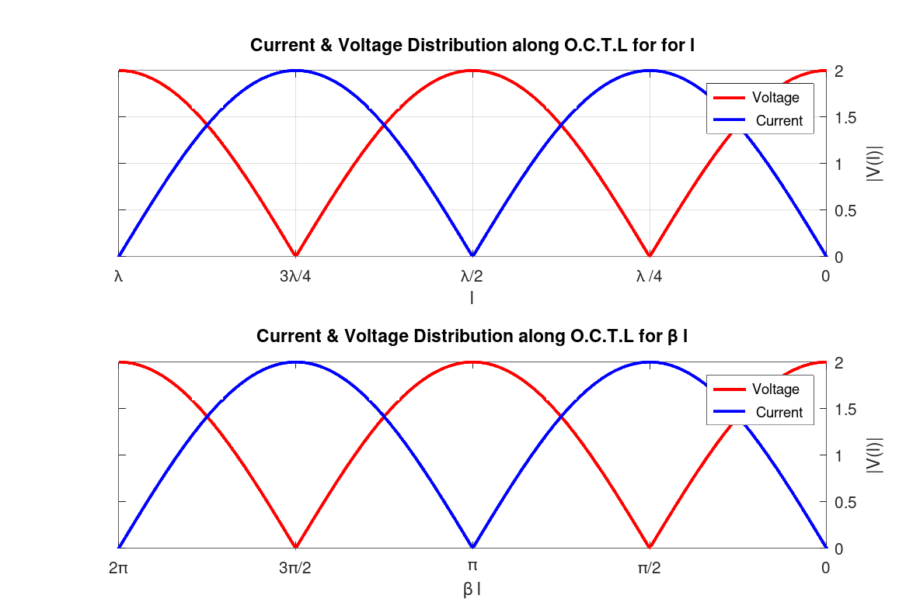

# Open-Circuit Transmission Line (O.C.T.L) Analysis

> By : Ahmed Khaled Fathy
>
> Super Visors
>
> Dr . Nur ad-Din M. Salem
>
> Eng . Ehab

This project analyzes the voltage and current distributions along an open-circuit transmission line using MATLAB. It visualizes these distributions for both length (l) and phase (βl) parameters.

## Contents

1. [Project Description](#project-description)
2. [MATLAB Scripts](#matlab-scripts)
3. [Results](#results)
4. [How to Run](#how-to-run)
5. [Additional Resources](#additional-resources)

## Project Description

The project focuses on plotting the voltage and current distributions for an open-circuit transmission line. It uses the following equations:

- Voltage Distribution: |V(l)| = |2V₀⁺| \* |cos(βl)|
- Current Distribution: |I(l)| = |(2V₀⁺)/Z₀| \* |sin(βl)|

Where:

- V₀⁺ is the amplitude of the incident voltage wave
- Z₀ is the characteristic impedance of the line
- β is the phase constant
- l is the distance along the line

## MATLAB Scripts

The project includes two MATLAB scripts:

1. [`Assiment1.m`](Assiment1.m): Plots separate graphs for voltage and current distributions.
2. [`bothV-I.m`](bothV-I.m): Plots voltage and current distributions on the same graph for comparison.

> **Note:** To use the combined plot functionality, replace the figure code in `Assiment1.m` with the code from `bothV-I.m`.

## Results

### Current Distribution

This graph shows the current distribution along the O.C.T.L for both l and βl. The current reaches its maximum at λ/4 and 3λ/4 (or π/2 and 3π/2 in terms of βl), and drops to zero at the open end (λ or 2π) and at λ/2 (or π).

### Voltage Distribution

This graph illustrates the voltage distribution along the O.C.T.L for both l and βl. The voltage is maximum at the open end (λ or 2π) and at λ/2 (or π), and minimum at λ/4 and 3λ/4 (or π/2 and 3π/2 in terms of βl).

### Combined Voltage & Current Distribution

This graph shows both voltage and current distributions on the same plot for easy comparison.

## How to Run

1. Ensure you have MATLAB installed on your system.
2. Clone this repository or download the MATLAB scripts.
3. Open MATLAB and navigate to the directory containing the scripts.
4. Run `Assiment1.m` for separate plots or modify it with the code from `bothV-I.m` for combined plots.
5. The resulting graphs will be displayed in MATLAB figure windows.

## Additional Resources

For a more detailed explanation of the project, including the theoretical background and additional visualizations, please refer to the [`assignment1.pdf`](assignment1.pdf) document included in this repository.
